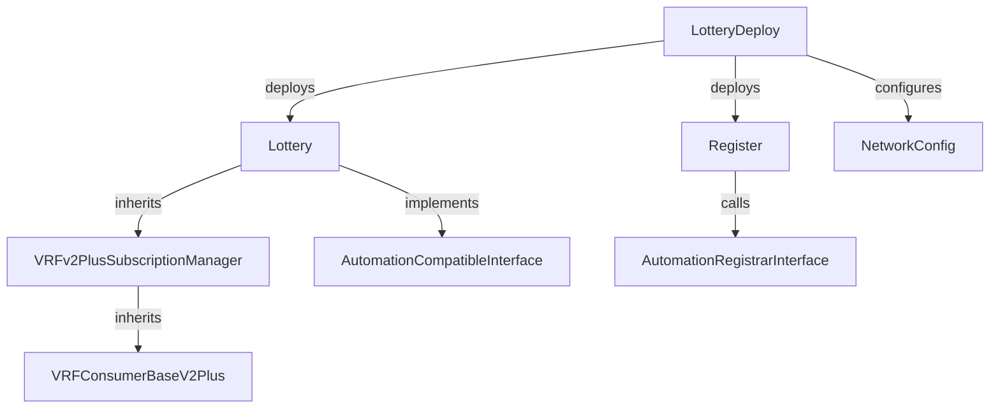
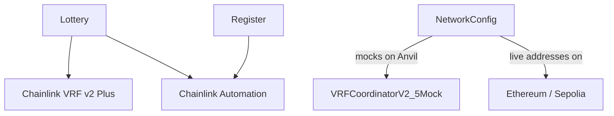

# Lottery

> A fully automated, trustless on-chain lottery using Chainlink VRF v2 Plus for verifiable randomness and Chainlink Automation for deadline-based winner selection.


---

## Table of Contents

- [Overview](#overview)
- [System Architecture](#system-architecture)
- [Tech Stack](#tech-stack)
- [Contract Architecture](#contract-architecture)
- [Execution Flow](#execution-flow)
- [Deployment Pipeline](#deployment-pipeline)
- [Key Design Decisions](#key-design-decisions)
- [Security Considerations](#security-considerations)
- [Gas Optimizations](#gas-optimizations)
- [Project Structure](#project-structure)
- [Getting Started](#getting-started)
- [Example Usage](#example-usage)
- [License](#license)

---

## Overview

A round-based lottery where users enter by sending a fixed ETH entry fee. Once the round deadline passes and a minimum of 2 players have entered, Chainlink Automation triggers a VRF randomness request. The VRF callback selects a winner, transfers the prize pool, and immediately starts the next round — with no owner intervention required at any point.

Failed ETH transfers (e.g. to smart contract winners that reject ETH) are tracked in a `pending_payouts` mapping and recoverable via a fallback withdrawal function.

---

## System Architecture

The system is split across three contracts with clear separation of concerns. `Lottery` inherits VRF subscription management and implements the game logic and Automation interface on top.

**Contract Architecture** — how contracts relate to each other:



**Shared Infrastructure** — external dependencies:



---

## Tech Stack

| Category | Technology | Role |
|---|---|---|
| Language | Solidity ^0.8.13 | Contract logic |
| Build / Test | Foundry (Forge) | Compilation, testing, fork testing |
| Randomness | Chainlink VRF v2 Plus | Provably fair winner selection |
| Automation | Chainlink Automation | Deadline-triggered upkeep |
| ETH Transfer | Solady `SafeTransferLib` | Gas-efficient safe ETH transfer |
| Reentrancy | OpenZeppelin `ReentrancyGuard` | Fallback withdrawal protection |
| Local Mocks | `VRFCoordinatorV2_5Mock`, `LinkToken` | Full local test environment |

---

## Contract Architecture

### `Lottery`

The core game contract. Inherits VRF management and implements `AutomationCompatibleInterface`. Key state:

- `i_entryPrice` — immutable entry fee in wei
- `i_length` — immutable round duration in seconds
- `i_gracePeriod` — immutable buffer after deadline before winner selection
- `entryDeadline` — timestamp; players cannot enter after this
- `pickWinnerDeadline` — timestamp; Automation triggers after this
- `players` — dynamic array of entrants, reset each round
- `pending_payouts` — mapping for failed ETH transfers; winner claims manually

### `VRFv2PlusSubscriptionManager`

Handles the full VRF subscription lifecycle: creates a subscription on deploy, funds it via `topUpSubscription` using ERC677 `transferAndCall`, and exposes `requestRandomWords`. The `fulfillRandomWords` callback is overridden by `Lottery` to implement winner selection logic.

### `Register`

Handles Chainlink Automation registration. Approves LINK to the Automation registrar and calls `registerUpkeep`. Separated from the lottery to keep deployment concerns isolated and to allow registration to happen after the lottery is funded — the ordering matters because the upkeep contract address must be known before registration.

### `NetworkConfig`

Script contract that resolves chain-specific addresses (VRF coordinator, LINK token, Automation registrar, key hash, gas limits) at deploy time. On local Anvil, it deploys `VRFCoordinatorV2_5Mock` and a `LinkToken` mock, enabling a fully self-contained test environment without RPC dependencies.

### `LotteryMockTest` (test mock)

Extends `Lottery` with a `testFulfillRandomWords()` function that bypasses the actual VRF callback. This allows tests to inject arbitrary random words directly, enabling deterministic winner selection testing without waiting for VRF responses. Also exposes internal state via getter functions (`getEntryDeadline`, `getPickWinnerDeadline`, etc.) since the production contract keeps these private.

---

## Execution Flow

**Round lifecycle:**

1. `fundAndStartLottery()` is called by the deployer — transfers LINK, funds the VRF subscription, calls `startLottery()`
2. `startLottery()` sets `entryDeadline = now + i_length` and `pickWinnerDeadline = entryDeadline + i_gracePeriod`, resets `players`
3. Players call `enterLottery{value: entryPrice}()` — checked against exact price and `entryDeadline`
4. Chainlink Automation polls `checkUpkeep()` — returns `true` when `block.timestamp >= pickWinnerDeadline && players.length >= 2`
5. Automation calls `performUpkeep()` → `requestRandomWords()` → VRF coordinator emits request
6. Chainlink VRF calls `fulfillRandomWords()` with random words → winner selected as `players[randomWords[0] % players.length]`
7. Prize (`players.length * i_entryPrice`) sent via low-level `.call`; if it fails, credited to `pending_payouts`
8. `startLottery()` is called again immediately — the next round begins within the same transaction

**Failed transfer recovery:**

1. Winner calls `winnerFallbackWithdrawal()`
2. `pending_payouts[msg.sender]` is read and deleted before transfer (CEI pattern)
3. `SafeTransferLib.safeTransferETH` sends the prize

---

## Deployment Pipeline

The deployment sequence is order-dependent and must be followed strictly:

```
1. Deploy Lottery         (LotteryDeploy.run())
2. Deploy Register        (LotteryDeploy.deployRegister(lotteryAddress))
3. Fund Register          (send LINK to Register address manually)
4. Register with Automation (LotteryDeploy.setRegisterAfterFunding(lotteryAddress))
5. Fund & Start Lottery   (LotteryDeploy.fundAndStartLottery(lotteryAddress))
```

`LotteryDeploy` tracks unfunded deployments in a `mapping(address => address)` linking each lottery to its `NetworkConfig`. This allows multi-step deployment across separate transactions without passing addresses manually between calls.

---

## Key Design Decisions

**`startLottery()` is called inside `fulfillRandomWords()`**
The next round begins within the same VRF callback transaction, immediately after the prize is distributed. This avoids a window where the contract holds funds but no round is active, and reduces the number of owner-initiated transactions to one (the initial `fundAndStartLottery`).

**`pending_payouts` instead of reverting on failed transfer**
If the winner is a contract that rejects ETH, reverting `fulfillRandomWords` would prevent the round from ever completing. Instead, the failed payout is recorded and the round proceeds. The winner recovers funds via `winnerFallbackWithdrawal`.

**VRF subscription owned by the `Lottery` contract itself**
The contract creates and funds its own VRF subscription rather than relying on an externally managed one. This keeps the lottery self-contained and avoids a dependency on the deployer maintaining a separate subscription balance.

**`NetworkConfig` deploys mocks on Anvil automatically**
Rather than requiring separate mock deployment scripts, `NetworkConfig` detects the chain ID and deploys `VRFCoordinatorV2_5Mock` and `LinkToken` inline. Tests on any network use the same deployment path — no separate mock setup is needed.

**`performUpkeep` restricted to `onlyOwner`**
Although Chainlink Automation is the intended caller, `onlyOwner` prevents arbitrary addresses from triggering upkeep and draining VRF subscription balance by spamming randomness requests.

**`players` uses `delete` not reassignment**
`delete players` clears the array in-place and is cheaper than `players = new address[](0)`, which allocates a new array. Measured savings: ~94 gas per round on `startLottery`.

---

## Security Considerations

| Vector | Mitigation |
|---|---|
| Reentrancy | `nonReentrant` on `winnerFallbackWithdrawal`; CEI pattern in fallback payout (`delete` before transfer) |
| Failed ETH transfer | `pending_payouts` mapping; funds never lost if winner rejects ETH |
| Randomness manipulation | Chainlink VRF v2 Plus — verifiable on-chain; no miner/operator influence |
| Upkeep spam | `performUpkeep` gated by `onlyOwner`; reduces VRF subscription drain risk |
| Prize calculation | `price = players.length * i_entryPrice` computed at payout time, not stored — reflects actual entries |
| Double withdrawal | `delete pending_payouts[msg.sender]` before `safeTransferETH` prevents double-claim |
| Premature round end | `pickWinnerDeadline = entryDeadline + i_gracePeriod` enforces a buffer; Automation cannot trigger before grace period |

---

## Gas Optimizations

Documented in `gas_optimizations/Report.md` with per-scenario Forge gas reports across 8 versioned test runs. Key findings:

| Optimization | Gas Saved | Method |
|---|---|---|
| `delete players` vs `new address[]` | ~94 gas / round | Clears array in-place |
| Cache `entryDeadline` in `startLottery` | ~52 gas / round | Avoid repeated SLOAD |
| Cache `players.length` in `get_winner_address` | ~58 gas / round | Avoid repeated array length reads |
| Pass `players.length` as parameter | ~2 gas / round | Eliminate redundant SLOAD across call |
| Private state variables | ~80 bytes bytecode | Removes auto-generated getters |
| Remove meaningless event in `startLottery` | ~300 bytes bytecode | Reduces bytecode and event overhead |
| Dynamic over fixed-size arrays | +~268 bytes bytecode (avoided) | Fixed arrays cost more to deploy |

Combining all optimizations reduced deployment size from 4,353 bytes to 3,700 bytes and cut runtime gas on key paths by ~200 gas per round.

---

## Project Structure

```
src/
  Lottery.sol                # Core game logic: entry, upkeep, VRF callback, payout
  VRFSubscriptionManager.sol # VRF subscription lifecycle management
  Register.sol               # Chainlink Automation registration helper
  lib/
    LotteryConstants.sol     # Chain-specific addresses and immutable config values

script/
  LotteryDeploy.s.sol        # Multi-step live deployment with funding sequencing
  LotteryMockDeploy.s.sol    # Mock deployment for local/fork testing
  NetworkConfig.s.sol        # Chain-aware config with local mock deployment

test/
  LotteryTest.t.sol          # Unit + fuzz tests across all network forks
  mocks/
    LotteryMock.sol          # Test harness: exposes internals, injects random words

gas_optimizations/
  Report.md                  # Documented optimization report with conclusions
  tests/                     # Raw Forge gas reports for each optimization scenario
```

---

## Getting Started

### Requirements

- [Foundry](https://book.getfoundry.sh/getting-started/installation)
- `.env` with `RPC_MAINNET` and/or `RPC_SEPOLIA` for fork tests

### Build

```bash
make build
```

### Test

```bash
make test             # all networks, verbose
make test-nv          # all networks, no verbosity
make test-local       # Anvil only
make test-sepolia     # Sepolia fork
make test-ethereum    # Mainnet fork
```

### Deploy (live network)

```bash
# 1. Deploy Lottery
forge script script/LotteryDeploy.s.sol:LotteryDeploy \
  --rpc-url <RPC_URL> --private-key $PRIVATE_KEY --broadcast

# 2–5. Follow deployment pipeline (see above)
```

---

## Example Usage

```solidity
// Enter the lottery
lottery.enterLottery{value: 0.01 ether}();

// Automation handles the rest — no manual calls needed after deployment

// If your ETH transfer failed, claim winnings manually
lottery.winnerFallbackWithdrawal();
```

---

## License

UNLICENSED

---

[↑ Back to top](#lottery)